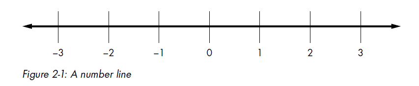
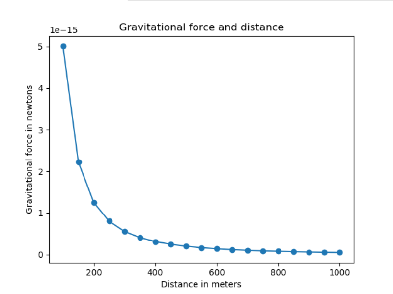
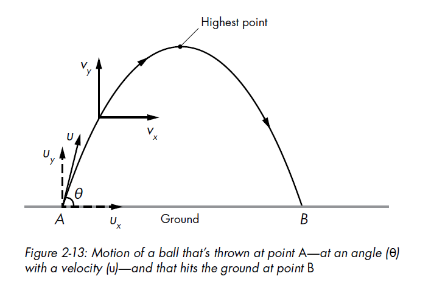
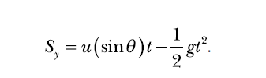

chapter 2: visualizing Data with Graphs
============================================
이 장에서는 다양한 데이터를 mathplotlib를 통해 표현하는 방법을 배우도록 하겠다.

2.1 Understanding the Cartesian Coordinate Plane
-----------------------------------------------------

다음처럼 숫자가 새겨진 라인을 생각해 보자.

아래는 Cartesian coordinate plane 을 나타낸다.

Working with Lists and Tuples
~~~~~~~~~~~~~~~~~~~~~~~~~~~~~~~~~~~~~
그래프를 그릴때 list,tuple을 많이 사용하게 될것이다.

Iterating over a List or Tuple
~~~~~~~~~~~~~~~~~~~~~~~~~~~~~~~

.. code-block:: python

    >>> l = [1, 2, 3]
    >>> for item in l:
    print(item)

    >>> l = [1, 2, 3]
    >>> for index, item in enumerate(l):
    print(index, item)

Creating Graphs with Matplotlib
~~~~~~~~~~~~~~~~~~~~~~~~~~~~~~~~~~

.. code-block:: python

    >>> x_numbers = [1, 2, 3]
    >>> y_numbers = [2, 4, 6]

    >>> from pylab import plot, show
    >>> plot(x_numbers, y_numbers)
    [<matplotlib.lines.Line2D object at 0x7f83ac60df10>]

    plot(x_numbers, y_numbers, marker='o')

    plot(x_numbers, y_numbers, 'o')

Graphing the Average Annual Temperature in New York City
~~~~~~~~~~~~~~~~~~~~~~~~~~~~~~~~~~~~~~~~~~~~~~~~~~~~~~~~~~~~~~

.. code-block:: python

    from pylab import plot, show

    nyc_temp = [53.9, 56.3, 56.4, 53.4, 54.5, 55.8, 56.8, 55.0, 55.3, 54.0, 56.7, 56.4, 57.3]

    years = range(2000, 2013)

    #plot(nyc_temp, marker='o')

    years = range(2000, 2013)
    plot(years, nyc_temp, marker='o')

    show()

Comparing the Monthly Temperature Trends of New York City
~~~~~~~~~~~~~~~~~~~~~~~~~~~~~~~~~~~~~~~~~~~~~~~~~~~~~~~~~~~~~~

.. code-block:: python

    from pylab import plot,show
    from pylab import legend
    legend([2000, 2006, 2012])

    nyc_temp_2000 = [31.3, 37.3, 47.2, 51.0, 63.5, 71.3, 72.3, 72.7, 66.0, 57.0, 45.3, 31.1]
    nyc_temp_2006 = [40.9, 35.7, 43.1, 55.7, 63.1, 71.0, 77.9, 75.8, 66.6, 56.2, 51.9, 43.6]
    nyc_temp_2012 = [37.3, 40.9, 50.9, 54.8, 65.1, 71.0, 78.8, 76.7, 68.8, 58.0, 43.9, 41.5]

    months = range(1, 13)

    #plot(months, nyc_temp_2000, months, nyc_temp_2006, months, nyc_temp_2012)

    #===============================================================================
    # plot(months, nyc_temp_2000)
    # plot(months, nyc_temp_2006)
    # plot(months, nyc_temp_2012)
    #===============================================================================

    plot(months, nyc_temp_2000, months, nyc_temp_2006, months, nyc_temp_2012)

    show()

Customizing Graphs
~~~~~~~~~~~~~~~~~~~~~~~

Adding a Title and Labels
~~~~~~~~~~~~~~~~~~~~~~~~~~~

.. code-block:: python

    from pylab import plot, show, title, xlabel, ylabel, legend

    months = range(1, 13)

    nyc_temp_2000 = [31.3, 37.3, 47.2, 51.0, 63.5, 71.3, 72.3, 72.7, 66.0, 57.0, 45.3, 31.1]
    nyc_temp_2006 = [40.9, 35.7, 43.1, 55.7, 63.1, 71.0, 77.9, 75.8, 66.6, 56.2, 51.9, 43.6]
    nyc_temp_2012 = [37.3, 40.9, 50.9, 54.8, 65.1, 71.0, 78.8, 76.7, 68.8, 58.0, 43.9, 41.5]

    plot(months, nyc_temp_2000, months, nyc_temp_2006, months, nyc_temp_2012)

    title('Average monthly temperature in NYC')
    xlabel('Month')
    ylabel('Temperature')
    legend([2000, 2006, 2012])

    show()

Customizing the Axes
~~~~~~~~~~~~~~~~~~~~~~~

.. code-block:: python

    from pylab import plot, show, axis

    nyc_temp = [53.9, 56.3, 56.4, 53.4, 54.5, 55.8, 56.8, 55.0, 55.3, 54.0, 56.7, 56.4, 57.3]
    plot(nyc_temp, marker='o')
    print(axis())
    axis(ymin=0)

    show()

Plotting Using pyplot
~~~~~~~~~~~~~~~~~~~~~

.. code-block:: python

    '''
    Simple plot using pyplot
    '''
    import matplotlib.pyplot
    def create_graph():
        x_numbers = [1, 2, 3]
        y_numbers = [2, 4, 6]
        matplotlib.pyplot.plot(x_numbers, y_numbers)
        matplotlib.pyplot.show()

    if __name__ == '__main__':
        create_graph()

 Saving the Plots
~~~~~~~~~~~~~~~~~~~

.. code-block:: python

    from pylab import plot, savefig
    x = [1, 2, 3]
    y = [2, 4, 6]
    plot(x, y)
    savefig('mygraph.png')

    #savefig('C:\mygraph.png')

Plotting with Formulas
~~~~~~~~~~~~~~~~~~~~~~~~~~~

Newton’s Law of Universal Gravitation
~~~~~~~~~~~~~~~~~~~~~~~~~~~~~~~~~~~~~~~~~~
Newton’s law of universal gravitation

.. code-block:: python

    '''
    The relationship between gravitational force and
    distance between two bodies
    '''
    import matplotlib.pyplot as plt
    # Draw the graph
    def draw_graph(x, y):
        plt.plot(x, y, marker='o')
        plt.xlabel('Distance in meters')
        plt.ylabel('Gravitational force in newtons')
        plt.title('Gravitational force and distance')
        plt.show()

    def generate_F_r():
    # Generate values for r
        r = range(100, 1001, 50)
    # Empty list to store the calculated values of F
        F = []
    # Constant, G
        G = 6.674*(10**-11)
    # Two masses
        m1 = 0.5
        m2 = 1.5
    # Calculate force and add it to the list, F
        for dist in r:
            force = G*(m1*m2)/(dist**2)
            F.append(force)
    # Call the draw_graph function
        draw_graph(r, F)
    if __name__=='__main__':
        generate_F_r()

Projectile Motion
~~~~~~~~~~~~~~~~~~

Generating Equally Spaced Floating Point Numbers
~~~~~~~~~~~~~~~~~~~~~~~~~~~~~~~~~~~~~~~~~~~~~~~~~~~~

.. code-block:: python

    '''
    Generate equally spaced floating point
    numbers between two given values
    '''
    def frange(start, final, increment):
        numbers = []
        while start < final:
            numbers.append(start)
            start = start + increment
            return numbers

Drawing the Trajectory
~~~~~~~~~~~~~~~~~~~~~~~

.. code-block:: python

    '''
    Draw the trajectory of a body in projectile motion
    '''
    from matplotlib import pyplot as plt
    import math
    def draw_graph(x, y):
        plt.plot(x, y)
        plt.xlabel('x-coordinate')
        plt.ylabel('y-coordinate')
        plt.title('Projectile motion of a ball')
    def frange(start, final, interval):
        numbers = []
        while start < final:
            numbers.append(start)
            start = start + interval
            return numbers
    def draw_trajectory(u, theta):
        theta = math.radians(theta)
        g = 9.8
    # Time of flight
        t_flight = 2*u*math.sin(theta)/g
    # Find time intervals
        intervals = frange(0, t_flight, 0.001)

        # List of x and y coordinates
        x = []
        y = []
        for t in intervals:
            x.append(u*math.cos(theta)*t)
            y.append(u*math.sin(theta)*t - 0.5*g*t*t)
            draw_graph(x, y)
    if __name__ == '__main__':
        try:
            u = float(input('Enter the initial velocity (m/s): '))
            theta = float(input('Enter the angle of projection (degrees): '))
        except ValueError:
            print('You entered an invalid input')
        else:
            draw_trajectory(u, theta)
            plt.show()

Comparing the Trajectory at Different Initial Velocities
~~~~~~~~~~~~~~~~~~~~~~~~~~~~~~~~~~~~~~~~~~~~~~~~~~~~~~~~~

.. code-block:: python

    '''
    Draw the trajectory of a body in projectile motion
    '''
    from matplotlib import pyplot as plt
    import math
    def draw_graph(x, y):
        plt.plot(x, y)
        plt.xlabel('x-coordinate')
        plt.ylabel('y-coordinate')
        plt.title('Projectile motion of a ball')
    def frange(start, final, interval):
        numbers = []
        while start < final:
            numbers.append(start)
            start = start + interval
            return numbers
    def draw_trajectory(u, theta):
        theta = math.radians(theta)
        g = 9.8
    # Time of flight
        t_flight = 2*u*math.sin(theta)/g
    # Find time intervals
        intervals = frange(0, t_flight, 0.001)

        # List of x and y coordinates
        x = []
        y = []
        for t in intervals:
            x.append(u*math.cos(theta)*t)
            y.append(u*math.sin(theta)*t - 0.5*g*t*t)
            draw_graph(x, y)
    if __name__ == '__main__':
        # List of three different initial velocities
        u_list = [20, 40, 60]
        theta = 45
        for u in u_list:
            draw_trajectory(u, theta)
    # Add a legend and show the graph
        plt.legend(['20', '40', '60'])
        plt.show()