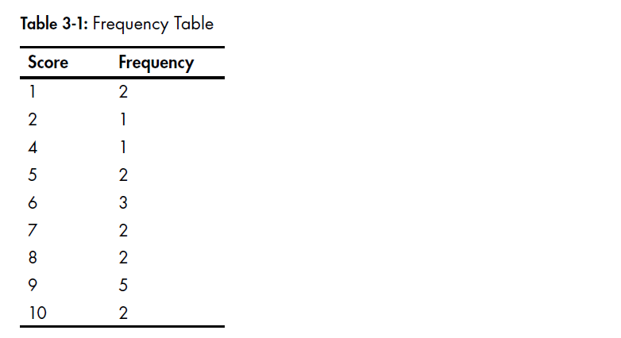
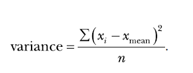
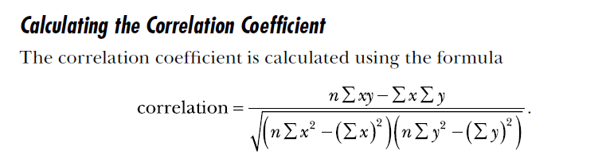
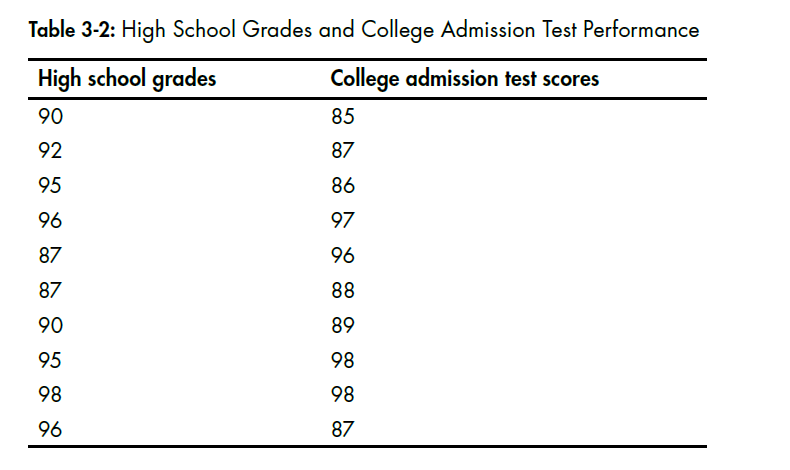

chapter 3: Describing Data With Statstics
==============================================
이 장에서는 통계치를 가지고 한번 파이썬 코드를 짜보자.

3.1 Finding the Mean
------------------------------

.. code-block:: python

    >>> shortlist = [1, 2, 3]
    >>> sum(shortlist)
    6

    >>> len(shortlist)
    3

.. code-block:: python

    '''
    Calculating the mean
    '''
    def calculate_mean(numbers):
        s = sum(numbers)
        N = len(numbers)
    # Calculate the mean
        mean = s/N
        return mean

    if __name__ == '__main__':
        donations = [100, 60, 70, 900, 100, 200, 500, 500, 503, 600, 1000, 1200]
        mean = calculate_mean(donations)
        N = len(donations)
        print('Mean donation over the last {0} days is {1}'.format(N, mean))

Finding the Median
~~~~~~~~~~~~~~~~~~~~~~~~

.. code-block:: python

    samplelist = [4, 1, 3]
    samplelist.sort()
    samplelist
    [1, 3, 4]

    '''
    Calculating the median
    '''
    def calculate_median(numbers):
        N = len(numbers)
        numbers.sort()
        # Find the median
        if N % 2 == 0:
            # if N is even
            m1 = N/2
            m2 = (N/2) + 1
            # Convert to integer, match position
            m1 = int(m1) - 1
            m2 = int(m2) - 1
            median = (numbers[m1] + numbers[m2])/2
        else:
            m = (N+1)/2
            # Convert to integer, match position
            m = int(m) - 1
            median = numbers[m]
        return median

    if __name__ == '__main__':
        donations = [100, 60, 70, 900, 100, 200, 500, 500, 503, 600, 1000, 1200]
        median = calculate_median(donations)
        N = len(donations)
        print('Median donation over the last {0} days is {1}'.format(N, median))

Finding the Mode and Creating a Frequency Table
~~~~~~~~~~~~~~~~~~~~~~~~~~~~~~~~~~~~~~~~~~~~~~~~~~~~~

Finding the Most Common Elements
~~~~~~~~~~~~~~~~~~~~~~~~~~~~~~~~~~~

.. code-block:: python

    >>> simplelist = [4, 2, 1, 3, 4]
    >>> from collections import Counter
    >>> c = Counter(simplelist)
    >>> c.most_common()
    [(4, 2), (1, 1), (2, 1), (3, 1)]

    >>> c.most_common(1)
    [(4, 2)]

    >>> c.most_common(2)
    [(4, 2), (1, 1)]

    >>> mode = c.most_common(1)
    >>> mode
    [(4, 2)]
    v >>> mode[0]
    (4, 2)
    w >>> mode[0][0]
    4

Finding the Mode
~~~~~~~~~~~~~~~~~~~~~~

.. code-block:: python

    '''
    Calculating the mode
    '''
    from collections import Counter
    def calculate_mode(numbers):
        c = Counter(numbers)
        mode = c.most_common(1)
        return mode[0][0]
    if __name__=='__main__':
        scores = [7, 8, 9, 2, 10, 9, 9, 9, 9, 4, 5, 6, 1, 5, 6, 7, 8, 6, 1, 10]
        mode = calculate_mode(scores)
        print('The mode of the list of numbers is: {0}'.format(mode))

    '''
    Calculating the mode when the list of numbers may
    have multiple modes
    '''
    from collections import Counter
    def calculate_mode(numbers):
        c = Counter(numbers)
        numbers_freq = c.most_common()
        max_count = numbers_freq[0][1]
        modes = []
        for num in numbers_freq:
            if num[1] == max_count:
                modes.append(num[0])
        return modes
    if __name__ == '__main__':
        scores = [5, 5, 5, 4, 4, 4, 9, 1, 3]
        modes = calculate_mode(scores)
        print('The mode(s) of the list of numbers are:')
        for mode in modes:
            print(mode)

Creating a Frequency Table
~~~~~~~~~~~~~~~~~~~~~~~~~~~~~~

.. code-block:: python

    '''
    Frequency table for a list of numbers
    '''
    from collections import Counter

    def frequency_table(numbers):
        table = Counter(numbers)
        print('Number\tFrequency')
        for number in table.most_common():
            print('{0}\t{1}'.format(number[0], number[1]))

    if __name__=='__main__':
        scores = [7, 8, 9, 2, 10, 9, 9, 9, 9, 4, 5, 6, 1, 5, 6, 7, 8, 6, 1, 10]
        frequency_table(scores)

    '''
    Frequency table for a list of numbers
    Enhanced to display the table sorted by the numbers
    '''
    from collections import Counter
    def frequency_table(numbers):
        table = Counter(numbers)
        numbers_freq = table.most_common()
        numbers_freq.sort()
        print('Number\tFrequency')
        for number in numbers_freq:
            print('{0}\t{1}'.format(number[0], number[1]))

    if __name__ == '__main__':
        scores = [7, 8, 9, 2, 10, 9, 9, 9, 9, 4, 5, 6, 1, 5, 6, 7, 8, 6, 1, 10]
        frequency_table(scores)

Measuring the Dispersion
---------------------------

Finding the Range of a Set of Numbers
~~~~~~~~~~~~~~~~~~~~~~~~~~~~~~~~~~~~~~~

.. code-block:: python

    '''
    Find the range
    '''
    def find_range(numbers):
        lowest = min(numbers)
        highest = max(numbers)
        # Find the range
        r = highest-lowest
        return lowest, highest, r
    if __name__ == '__main__':
        donations = [100, 60, 70, 900, 100, 200, 500, 500, 503, 600, 1000, 1200]
        lowest, highest, r = find_range(donations)
        print('Lowest: {0} Highest: {1} Range: {2}'.format(lowest, highest, r))

Finding the Variance and Standard Deviation
~~~~~~~~~~~~~~~~~~~~~~~~~~~~~~~~~~~~~~~~~~~~~~

.. code-block:: python

    '''
    Find the variance and standard deviation of a list of numbers
    '''
    def calculate_mean(numbers):
        s = sum(numbers)
        N = len(numbers)
        # Calculate the mean
        mean = s/N
        return mean
    def find_differences(numbers):
        # Find the mean
        mean = calculate_mean(numbers)
        # Find the differences from the mean
        diff = []

        for num in numbers:
            diff.append(num-mean)
        return diff

        def calculate_variance(numbers):
            # Find the list of differences
            diff = find_differences(numbers)
            # Find the squared differences
            squared_diff = []
            for d in diff:
                squared_diff.append(d**2)
            # Find the variance
            sum_squared_diff = sum(squared_diff)
            variance = sum_squared_diff/len(numbers)
            return variance

    if __name__ == '__main__':
        donations = [100, 60, 70, 900, 100, 200, 500, 500, 503, 600, 1000, 1200]
        variance = calculate_variance(donations)
        print('The variance of the list of numbers is {0}'.format(variance))
        std = variance**0.5
        print('The standard deviation of the list of numbers is {0}'.format(std))

Calculating the Correlation Between Two Data Sets
~~~~~~~~~~~~~~~~~~~~~~~~~~~~~~~~~~~~~~~~~~~~~~~~~~~~~~

.. code-block:: python

    def find_corr_x_y(x,y):
        n = len(x)
        # Find the sum of the products
        prod = []
        for xi,yi in zip(x,y):
            prod.append(xi*yi)
        sum_prod_x_y = sum(prod)
        sum_x = sum(x)
        sum_y = sum(y)
        squared_sum_x = sum_x**2
        squared_sum_y = sum_y**2
        x_square = []
        for xi in x:
            x_square.append(xi**2)
        # Find the sum
        x_square_sum = sum(x_square)
        y_square=[]
        for yi in y:
            y_square.append(yi**2)
        # Find the sum
        y_square_sum = sum(y_square)

        # Use formula to calculate correlation
        numerator = n*sum_prod_x_y - sum_x*sum_y
        denominator_term1 = n*x_square_sum - squared_sum_x
        denominator_term2 = n*y_square_sum - squared_sum_y
        denominator = (denominator_term1*denominator_term2)**0.5
        correlation = numerator/denominator
        return correlation

High School Grades and Performance on College Admission Tests
~~~~~~~~~~~~~~~~~~~~~~~~~~~~~~~~~~~~~~~~~~~~~~~~~~~~~~~~~~~~~~~~~~

Reading Data from Files
~~~~~~~~~~~~~~~~~~~~~~~~

.. code-block:: python

    # Find the sum of numbers stored in a file
    def sum_data(filename):
        s = 0
        with open(filename) as f:
            for line in f:
                s = s + float(line)
            print('Sum of the numbers: {0}'.format(s))
    if __name__ == '__main__':
        sum_data('mydata.txt')

    '''
    Calculating the mean of numbers stored in a file
    '''
    def read_data(filename):
        numbers = []
        with open(filename) as f:
            for line in f:
                numbers.append(float(line))
        return numbers
    def calculate_mean(numbers):
        s = sum(numbers)
        N = len(numbers)
        mean = s/N
        return mean
    if __name__ == '__main__':
        data = read_data('mydata.txt')
        mean = calculate_mean(data)
        print('Mean: {0}'.format(mean))

Reading Data from a CSV File
~~~~~~~~~~~~~~~~~~~~~~~~~~~~~~~

.. code-block:: python

    import csv
    import matplotlib.pyplot as plt
    def scatter_plot(x, y):
        plt.scatter(x, y)
        plt.xlabel('Number')
        plt.ylabel('Square')
        plt.show()
    def read_csv(filename):
        numbers = []
        squared = []
        with open(filename) as f:
            reader = csv.reader(f)
            next(reader)
            for row in reader:
                numbers.append(int(row[0]))
                squared.append(int(row[1]))
            return numbers, squared
    if __name__ == '__main__':
        numbers, squared = read_csv('numbers.csv')
        scatter_plot(numbers, squared)