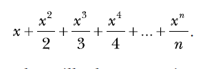
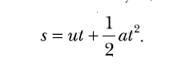

chapter 4: Algebra And Symbolic Math with Sympy
==================================================
이 장에서는 SymPy 라이브러리를 집중 분석해 보도록 하자.

4.1 Defining Symbols and Symbolic Operations
------------------------------------------------

.. code-block:: python

    >>> from sympy import Symbol
    >>> x = Symbol('x')

    >>> from sympy import Symbol
    >>> x = Symbol('x')
    >>> x + x + 1
    2*x + 1

    >>> x = Symbol('x')
    >>> y = Symbol('y')
    >>> z = Symbol('z')

    >>> from sympy import symbols
    >>> x,y,z = symbols('x,y,z')

    >>> from sympy import Symbol
    >>> x = Symbol('x')
    >>> y = Symbol('y')
    96 Chapter 4
    >>> s = x*y + x*y
    >>> s
    2*x*y

    >>> p = x*(x + x)
    >>> p
    2*x**2

    >>> p = (x + 2)*(x + 3)
    >>> p
    (x + 2)*(x + 3)

4.2 Working with Expressions
--------------------------------

Factorizing and Expanding Expressions
~~~~~~~~~~~~~~~~~~~~~~~~~~~~~~~~~~~~~~~~~
x2 − y2 = (x + y)(x − y).

.. code-block:: python

    from sympy import Symbol
    x = Symbol('x')
    y = Symbol('y')

    from sympy import factor,expand
    expr = x**2 - y**2
    print(factor(expr))
    #(x - y)*(x + y)

    factors = factor(expr)
    print(expand(factors))
    #x**2 - y**2

x3 + 3x2y + 3xy2 + y3 = (x + y)3

.. code-block:: python

    from sympy import factor,expand
    expr = x**3 + 3*x**2*y + 3*x*y**2 + y**3
    factors = factor(expr)
    print(factors)
    #(x + y)**3
    print(expand(factors))
    #x**3 + 3*x**2*y + 3*x*y**2 + y**3

Pretty Printing
~~~~~~~~~~~~~~~~~~~

.. code-block:: python

    from sympy import Symbol,factor,expand
    x=Symbol('x')
    y=Symbol('y')
    expr = x*x + 2*x*y + y*y
    print(expr)

    from sympy import Symbol,factor,expand
    x=Symbol('x')
    y=Symbol('y')
    expr = x*x + 2*x*y + y*y
    print(expr)

    from sympy import pprint

    pprint(expr)

    expr = 1 + 2*x + 2*x**2

    pprint(expr)

.. code-block:: python

    #-*-coding:utf-8
    from sympy import Symbol,factor,expand
    x=Symbol('x')
    y=Symbol('y')
    expr = x*x + 2*x*y + y*y
    print(expr)

    from sympy import pprint

    pprint(expr)

    expr = 1 + 2*x + 2*x**2

    pprint(expr)

    from sympy import init_printing
    init_printing(order='rev-lex')
    pprint(expr)
    #1 + 2·x + 2·x 2

Printing a Series
~~~~~~~~~~~~~~~~~~~~

.. code-block:: python

    '''
    Print the series:
    x + x**2 + x**3 + ... + x**n
    ____ _____ _____
    2 3 n
    '''
    from sympy import Symbol, pprint, init_printing
    def print_series(n):
        # Initialize printing system with reverse order
        init_printing(order='rev-lex')
        x = Symbol('x')
        series = x
        for i in range(2, n+1):
            series = series + (x**i)/i
        pprint(series)

    if __name__ == '__main__':
            n = input('Enter the number of terms you want in the series: ')
            print_series(int(n))

Substituting in Values
~~~~~~~~~~~~~~~~~~~~~~~~~

x2 + 2xy + y2

.. code-block:: python

    from sympy import Symbol

    x=Symbol('x')
    y=Symbol('y')

    print(x*x + x*y + x*y + y*y)

    expr = x*x + x*y + x*y + y*y

    res = expr.subs({x:1, y:2})

    print(res)

    print(expr.subs({x:1-y}))

    expr_subs = expr.subs({x:1-y})

    from sympy import simplify

    print(simplify(expr_subs))

Calculating the Value of a Series
~~~~~~~~~~~~~~~~~~~~~~~~~~~~~~~~~~~~~~

.. code-block:: python

    '''
    Print the series:
    x + x**2 + x**3 + ... + x**n
    ____ _____ _____
    2 3 n
    '''
    from sympy import Symbol, pprint, init_printing
    def print_series(n, x_value):
        # Initialize printing system with reverse order
        init_printing(order='rev-lex')
        x = Symbol('x')
        series = x
        for i in range(2, n+1):
            series = series + (x**i)/i
        pprint(series)
        # Evaluate the series at x_value
        series_value = series.subs({x:x_value})
        print('Value of the series at {0}: {1}'.format(x_value, series_value))
    if __name__ == '__main__':
        n = input('Enter the number of terms you want in the series: ')
        x_value = input('Enter the value of x at which you want to evaluate the series: ')
        print_series(int(n), float(x_value))

Converting Strings to Mathematical Expressions
~~~~~~~~~~~~~~~~~~~~~~~~~~~~~~~~~~~~~~~~~~~~~~~~~

.. code-block:: python

    from sympy import sympify
    expr = input('Enter a mathematical expression: ')
    #Enter a mathematical expression: x**2 + 3*x + x**3 + 2*x
    expr = sympify(expr)

    print(2*expr)

    #expr = input('Enter a mathematical expression: ')
    #Enter a mathematical expression: x**2 + 3*x + x**3 + 2x
    #expr = sympify(expr)
    #print(expr)

    from sympy import sympify
    from sympy.core.sympify import SympifyError
    expr = input('Enter a mathematical expression: ')
    #Enter a mathematical expression: x**2 + 3*x + x**3 + 2x
    try:
        expr = sympify(expr)
    except SympifyError:
        print('Invalid input')

Expression Multiplier
~~~~~~~~~~~~~~~~~~~~~~~

.. code-block:: python

    '''
    Product of two expressions
    '''
    from sympy import expand, sympify
    from sympy.core.sympify import SympifyError
    def product(expr1, expr2):
        prod = expand(expr1*expr2)
        print(prod)
    if __name__=='__main__':
        expr1 = input('Enter the first expression: ')
        #Enter the first expression: x**2 + x*2 + x
        expr2 = input('Enter the second expression: ')
        #Enter the second expression: x**3 + x*3 + x
        try:
            expr1 = sympify(expr1)
            expr2 = sympify(expr2)
        except SympifyError:
            print('Invalid input')
        else:
            product(expr1, expr2)

    #x**5 + 3*x**4 + 4*x**3 + 12*x**2

    #===============================================================================
    # Enter the first expression: x*y+x
    # Enter the second expression: x*x+y
    # x**3*y + x**3 + x*y**2 + x*y
    #===============================================================================

Solving Equations
~~~~~~~~~~~~~~~~~~

.. code-block:: python

    from sympy import Symbol, solve
    x = Symbol('x')
    expr = x - 5 - 7
    print(solve(expr))

Solving Quadratic Equations
~~~~~~~~~~~~~~~~~~~~~~~~~~~~

.. code-block:: python

    from sympy import solve,Symbol
    x = Symbol('x')
    expr = x**2 + 5*x + 4
    print(solve(expr, dict=True))
    #x [{x: -4}, {x: -1}]

x2 + x + 1 = 0

.. code-block:: python

    from sympy import Symbol,solve
    x=Symbol('x')
    expr = x**2 + x + 1
    print(solve(expr, dict=True))
    #[{x: -1/2 - sqrt(3)*I/2}, {x: -1/2 + sqrt(3)*I/2}]

 Solving for One Variable in Terms of Others
~~~~~~~~~~~~~~~~~~~~~~~~~~~~~~~~~~~~~~~~~~~~~

ax2 + bx + c = 0

.. code-block:: python

    from sympy import symbol

    x = Symbol('x')
    a = Symbol('a')
    b = Symbol('b')
    c = Symbol('c')

    expr = a*x*x + b*x + c
    print(solve(expr, x, dict=True))
    #[{x: (-b + sqrt(-4*a*c + b**2))/(2*a)}, {x: -(b + sqrt(-4*a*c + b**2))/(2*a)}]

.. code-block:: python

    from sympy import Symbol, solve, pprint
    s = Symbol('s')
    u = Symbol('u')
    t = Symbol('t')
    a = Symbol('a')
    expr = u*t + (1/2)*a*t*t - s
    t_expr = solve(expr,t, dict=True)
    pprint(t_expr)

 .. image:: ./img/chapter4-3.png

Solving a System of Linear Equations
~~~~~~~~~~~~~~~~~~~~~~~~~~~~~~~~~~~~~
2x + 3y = 6
3x + 2y = 12

.. code-block:: python

    #-*-coding=utf-8
    from sympy import Symbol,solve

    x = Symbol('x')
    y = Symbol('y')
    expr1 = 2*x + 3*y - 6
    expr2 = 3*x + 2*y - 12

    print(solve((expr1, expr2), dict=True))

    soln = solve((expr1, expr2), dict=True)
    soln = soln[0]
    print(expr1.subs({x:soln[x], y:soln[y]}))
    #0
    print(expr2.subs({x:soln[x], y:soln[y]}))
    #0

Plotting Using SymPy
~~~~~~~~~~~~~~~~~~~~~~

.. code-block:: python

    from sympy.plotting import plot
    from sympy import Symbol
    x = Symbol('x')
    #plot(2*x+3)

    #plot((2*x + 3), (x, -5, 5))

    #plot(2*x + 3, (x, -5, 5), title='A Line', xlabel='x', ylabel='2x+3')

    p = plot(2*x + 3, (x, -5, 5), title='A Line', xlabel='x', ylabel='2x+3', show=False)
    p.save('line.png')

Plotting Expressions Input by the User
~~~~~~~~~~~~~~~~~~~~~~~~~~~~~~~~~~~~~~~~

y = 2x + 3,

.. code-block:: python

    from sympy import Symbol,solve,sympify
    expr = input('Enter an expression: ')
    #Enter an expression: 2*x + 3*y - 6
    expr = sympify(expr)
    y = Symbol('y')
    print(solve(expr, y))

