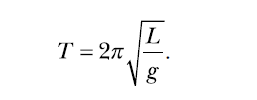
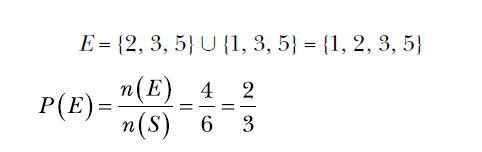
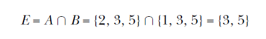
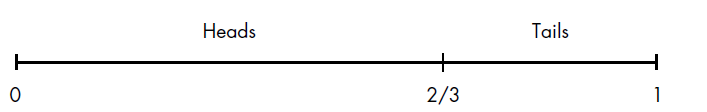

chapter 5: Playing with Sets and Probability
============================================================
이 장에서는 Probability 와 Random에 대해서 집중 공부하도록 하자.

5.1 What’s a Set?
----------------------------------------

Set Construction
~~~~~~~~~~~~~~~~~~~~~~~~~~~~~~~
Sympy를 이용하여 Python을 설정하는것을 알아보자.

.. code-block:: python

    from sympy import FiniteSet
    s = FiniteSet(2, 4, 6)
    print(s)

    from sympy import FiniteSet
    from fractions import Fraction
    s = FiniteSet(1, 1.5, Fraction(1, 5))
    print(s)

    print(len(s))

    print(4 in s)

    s = FiniteSet()
    print(s)
    #EmptySet()

    members = [1, 2, 3]
    s = FiniteSet(*members)
    print(s)
    #{1, 2, 3}

Set Repetition and Order
~~~~~~~~~~~~~~~~~~~~~~~~~~~

.. code-block:: python

    from sympy import FiniteSet
    members = [1, 2, 3, 2]
    print(FiniteSet(*members))

    from sympy import FiniteSet
    s = FiniteSet(1, 2, 3)
    for member in s:
        print(member)

    from sympy import FiniteSet
    s = FiniteSet(3, 4, 5)
    t = FiniteSet(5, 4, 3)
    print(s == t)

Subsets, Supersets, and Power Sets
~~~~~~~~~~~~~~~~~~~~~~~~~~~~~~~~~~~~~

.. code-block:: python

    from sympy import FiniteSet
    s = FiniteSet(1)
    t = FiniteSet(1,2)
    print(s.is_subset(t))
    #True
    print(t.is_subset(s))
    #False

    print(s.is_superset(t))
    #False
    print(t.is_superset(s))
    #True

    s = FiniteSet(1, 2, 3)
    ps = s.powerset()
    print(ps)

    from sympy import FiniteSet
    s = FiniteSet(1, 2, 3)
    t = FiniteSet(1, 2, 3)
    print(s.is_proper_subset(t))
    #False
    print(t.is_proper_superset(s))
    #False

    t = FiniteSet(1, 2, 3, 4)
    print(s.is_proper_subset(t))
    #True
    print(t.is_proper_superset(s))
    #True

Set Operations
-----------------

Union and Intersection
~~~~~~~~~~~~~~~~~~~~~~~~~

.. code-block:: python

    from sympy import FiniteSet
    s = FiniteSet(1, 2, 3)
    t = FiniteSet(2, 4, 6)
    print(s.union(t))
    #{1, 2, 3, 4, 6}

    s = FiniteSet(1, 2)
    t = FiniteSet(2, 3)
    print(s.intersect(t))
    #{2}

    from sympy import FiniteSet
    s = FiniteSet(1, 2, 3)
    t = FiniteSet(2, 4, 6)
    u = FiniteSet(3, 5, 7)
    print(s.union(t).union(u))
    #{1, 2, 3, 4, 5, 6, 7}

    print(s.intersect(t).intersect(u))
    #EmptySet()

Cartesian Product
~~~~~~~~~~~~~~~~~~~~~

.. code-block:: python

    from sympy import FiniteSet
    s = FiniteSet(1, 2)
    t = FiniteSet(3, 4)
    p = s*t
    print(p)

    for elem in p:
        print(elem)

    print(len(p) == len(s)*len(t))

    from sympy import FiniteSet
    s = FiniteSet(1, 2)
    p = s**3
    print(p)

    for elem in p:
        print(elem)

Applying a Formula to Multiple Sets of Variables
~~~~~~~~~~~~~~~~~~~~~~~~~~~~~~~~~~~~~~~~~~~~~~~~~~~

.. code-block:: python

    from sympy import FiniteSet, pi
    def time_period(length):
        g = 9.8
        T = 2*pi*(length/g)**0.5
        return T
    if __name__ == '__main__':
        L = FiniteSet(15, 18, 21, 22.5, 25)
        for l in L:
            t = time_period(l/100)
            print('Length: {0} cm Time Period: {1:.3f} s'. format(float(l), float(t)))

Different Gravity, Different Results
~~~~~~~~~~~~~~~~~~~~~~~~~~~~~~~~~~~~~~~

.. code-block:: python

    from sympy import FiniteSet, pi
    def time_period(length, g):
        T = 2*pi*(length/g)**0.5
        return T
    if __name__ == '__main__':
        L = FiniteSet(15, 18, 21, 22.5, 25)
        g_values = FiniteSet(9.8, 9.78, 9.83)
        print('{0:^15}{1:^15}{2:^15}'.format('Length(cm)', 'Gravity(m/s^2)', 'Time Period(s)'))
        for elem in L*g_values:
            l = elem[0]
            g = elem[1]
            t = time_period(l/100, g)
            print('{0:^15}{1:^15}{2:^15.3f}'.format(float(l), float(g), float(t)))

Probability
-----------------

.. code-block:: python

    def probability(space, event):
        return len(event)/len(space)
        def check_prime(number):
            if number != 1:
                for factor in range(2, number):
                    if number % factor == 0:
                        return False
            else:
                return False
            return True
    if __name__ == '__main__':
        space = FiniteSet(*range(1, 21))
        primes = []
        for num in s:
            if check_prime(num):
                primes.append(num)
        event= FiniteSet(*primes)
        p = probability(space, event)
        print('Sample space: {0}'.format(space))
        print('Event: {0}'.format(event))
        print('Probability of rolling a prime: {0:.5f}'.format(p))

.. code-block:: python

    from sympy import FiniteSet
    def probability(space, event):
        return len(event)/len(space)
    def check_prime(number):
        if number != 1:
            for factor in range(2, number):
                if number % factor == 0:
                    return False
        else:
            return False
        return True
    if __name__ == '__main__':
        space = FiniteSet(*range(1, 21))
        primes = []
        for num in space:
            if check_prime(num):
                primes.append(num)
        event= FiniteSet(*primes)
        p = probability(space, event)
        print('Sample space: {0}'.format(space))
        print('Event: {0}'.format(event))
        print('Probability of rolling a prime: {0:.5f}'.format(p))

Probability of Event A or Event B
~~~~~~~~~~~~~~~~~~~~~~~~~~~~~~~~~~~~~~

.. code-block:: python

    from sympy import FiniteSet
    s = FiniteSet(1, 2, 3, 4, 5, 6)
    a = FiniteSet(2, 3, 5)
    b = FiniteSet(1, 3, 5)
    e = a.union(b)
    print(len(e)/len(s))
    #0.6666666666666666

Probability of Event A and Event B
~~~~~~~~~~~~~~~~~~~~~~~~~~~~~~~~~~~~~~

.. code-block:: python

    from sympy import FiniteSet
    s = FiniteSet(1, 2, 3, 4, 5, 6)
    a = FiniteSet(2, 3, 5)
    b = FiniteSet(1, 3, 5)
    e = a.intersect(b)
    print(len(e)/len(s))
    #0.3333333333333333

Generating Random Numbers
-----------------------------

Simulating a Die Roll
~~~~~~~~~~~~~~~~~~~~~~

.. code-block:: python

    import random
    print(random.randint(1, 6))

Can You Roll That Score?
~~~~~~~~~~~~~~~~~~~~~~~~~~

.. code-block:: python

    '''
    Roll a die until the total score is 20
    '''
    import matplotlib.pyplot as plt
    import random
    target_score = 20
    def roll():
        return random.randint(1, 6)
    if __name__ == '__main__':
        score = 0
        num_rolls = 0
        while score < target_score:
            die_roll = roll()
            num_rolls += 1
            print('Rolled: {0}'.format(die_roll))
            score += die_roll
        print('Score of {0} reached in {1} rolls'.format(score, num_rolls))

 Is the Target Score Possible?
~~~~~~~~~~~~~~~~~~~~~~~~~~~~~~~~~

.. code-block:: python

    from sympy import FiniteSet
    import random
    def find_prob(target_score, max_rolls):
        die_sides = FiniteSet(1, 2, 3, 4, 5, 6)
        # Sample space
        s = die_sides**max_rolls
        # Find the event set
        if max_rolls > 1:
            success_rolls = []
            for elem in s:
                if sum(elem) >= target_score:
                    success_rolls.append(elem)
        else:
            if target_score > 6:
                success_rolls = []
            else:
                success_rolls = []
                for roll in die_sides:
                    if roll >= target_score:
                        success_rolls.append(roll)
        e = FiniteSet(*success_rolls)
        # Calculate the probability of reaching target score
        return len(e)/len(s)
    if __name__ == '__main__':
        target_score = int(input('Enter the target score: '))
        max_rolls = int(input('Enter the maximum number of rolls allowed: '))
        p = find_prob(target_score, max_rolls)
        print('Probability: {0:.5f}'.format(p))

Nonuniform Random Numbers
~~~~~~~~~~~~~~~~~~~~~~~~~~~~~~

.. image:: ./img/chapter5-4.png

.. code-block:: python

    import random
    def toss():
        # 0 -> Heads, 1-> Tails
        if random.random() < 2/3:
            return 0
        else:
            return 1

    '''
    Simulate a fictional ATM that dispenses dollar bills
    of various denominations with varying probability
    '''
    import random
    def get_index(probability):
        c_probability = 0
        sum_probability = []
        for p in probability:
            c_probability += p
            sum_probability.append(c_probability)
        r = random.random()
        for index, sp in enumerate(sum_probability):
            if r <= sp:
                return index
        return len(probability)-1
    def dispense():
        dollar_bills = [5, 10, 20, 50]
        probability = [1/6, 1/6, 1/3, 2/3]
        bill_index = get_index(probability)
        return dollar_bills[bill_index]

