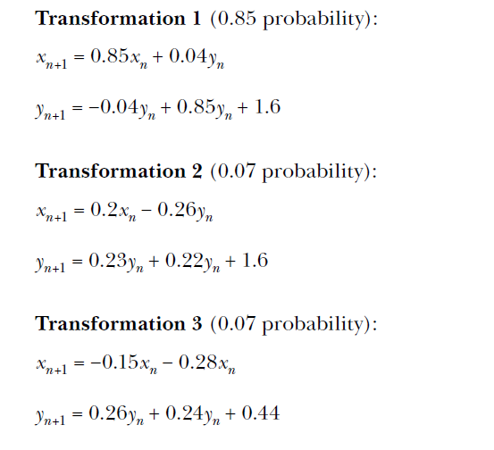
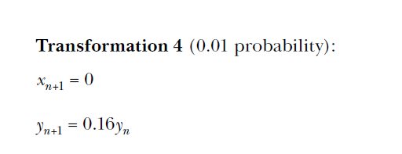

chapter 6: Drawing Geometric shapes and fractals
====================================================
이 장에서는 fractal 그리는 연습을 해보도록 하자.

Drawing Geometric Shapes with Matplotlib’s Patches
------------------------------------------------------------

.. code-block:: python

    import matplotlib.pyplot as plt
    x = [1, 2, 3]
    y = [1, 2, 3]
    plt.plot(x, y)
    #[<matplotlib.lines.Line2D object at 0x7fe822d67a20>]
    plt.show()

    import matplotlib.pyplot as plt
    x = [1, 2, 3]
    y = [1, 2, 3]
    fig = plt.figure()
    ax = plt.axes()
    plt.plot(x, y)
    #[<matplotlib.lines.Line2D object at 0x7f9bad1dcc18>]
    plt.show()

Drawing a Circle
~~~~~~~~~~~~~~~~~~

.. code-block:: python

    '''
    Example of using matplotlib's Circle patch
    '''
    import matplotlib.pyplot as plt
    def create_circle():
        circle = plt.Circle((0, 0), radius = 0.5)
        return circle
    def show_shape(patch):
        ax = plt.gca()
        ax.add_patch(patch)
        plt.axis('scaled')
        plt.show()
    if __name__ == '__main__':
        c = create_circle()
        show_shape(c)

Creating Animated Figures
~~~~~~~~~~~~~~~~~~~~~~~~~~~

.. code-block:: python

    '''
    A growing circle
    '''
    from matplotlib import pyplot as plt
    from matplotlib import animation
    def create_circle():
        circle = plt.Circle((0, 0), 0.05)
        return circle
    def update_radius(i, circle):
        circle.radius = i*0.5
        return circle,
    def create_animation():
        fig = plt.gcf()
        ax = plt.axes(xlim=(-10, 10), ylim=(-10, 10))
        ax.set_aspect('equal')
        circle = create_circle()
        ax.add_patch(circle)
        anim = animation.FuncAnimation(
            fig, update_radius, fargs = (circle,), frames=30, interval=50)
        plt.title('Simple Circle Animation')
        plt.show()
    if __name__ == '__main__':
        create_animation()

Animating a Projectile’s Trajectory
~~~~~~~~~~~~~~~~~~~~~~~~~~~~~~~~~~~~~~~~

.. code-block:: python

    '''
    Animate the trajectory of an object in projectile motion
    '''
    from matplotlib import pyplot as plt
    from matplotlib import animation
    import math
    g = 9.8
    def get_intervals(u, theta):
        flight = 2*u*math.sin(theta)/g
        intervals = []
        start = 0
        interval = 0.005
        while start < t_flight:
            intervals.append(start)
            start = start + interval
        return intervals
    def update_position(i, circle, intervals, u, theta):
        t = intervals[i]
        x = u*math.cos(theta)*t
        y = u*math.sin(theta)*t - 0.5*g*t*t
        circle.center = x, y
        return circle,

    def create_animation(u, theta):
        intervals = get_intervals(u, theta)
        xmin = 0
        xmax = u*math.cos(theta)*intervals[-1]
        ymin = 0
        t_max = u*math.sin(theta)/g
        ymax = u*math.sin(theta)*t_max - 0.5*g*t_max**2
        fig = plt.gcf()
        ax = plt.axes(xlim=(xmin, xmax), ylim=(ymin, ymax))
        circle = plt.Circle((xmin, ymin), 1.0)
        ax.add_patch(circle)
        anim = animation.FuncAnimation(fig, update_position,
                                        fargs=(circle, intervals, u, theta),
                                        frames=len(intervals), interval=1,
                                        repeat=False)
        plt.title('Projectile Motion')
        plt.xlabel('X')
        plt.ylabel('Y')
        plt.show()
    if __name__ == '__main__':
        try:
            u = float(input('Enter the initial velocity (m/s): '))
            theta = float(input('Enter the angle of projection (degrees): '))
        except ValueError:
            print('You entered an invalid input')
        else:
            theta = math.radians(theta)
            create_animation(u, theta)

Drawing Fractals
----------------------

Transformations of Points in a Plane
~~~~~~~~~~~~~~~~~~~~~~~~~~~~~~~~~~~~~~~

.. code-block:: python

    '''
    Example of selecting a transformation from two equally probable
    transformations
    '''
    import matplotlib.pyplot as plt
    import random
    def transformation_1(p):
        x = p[0]
        y = p[1]
        return x + 1, y - 1
    def transformation_2(p):
        x = p[0]
        y = p[1]
        return x + 1, y + 1
    def transform(p):
        # List of transformation functions
        transformations = [transformation_1, transformation_2]
        # Pick a random transformation function and call it
        t = random.choice(transformations)
        x, y = t(p)
        return x, y
    def build_trajectory(p, n):
        x = [p[0]]
        y = [p[1]]
        for i in range(n):
            p = transform(p)
            x.append(p[0])
            y.append(p[1])
        return x, y
    if __name__ == '__main__':
        # Initial point
        p = (1, 1)
        n = int(input('Enter the number of iterations: '))
        x, y = build_trajectory(p, n)
        # Plot
        plt.plot(x, y)
        plt.xlabel('X')
        plt.ylabel('Y')
        plt.show()

Drawing the Barnsley Fern
~~~~~~~~~~~~~~~~~~~~~~~~~~~~~~~

.. code-block:: python

    '''
    Draw a Barnsley Fern
    '''
    import random
    import matplotlib.pyplot as plt
    def transformation_1(p):
        x = p[0]
        y = p[1]
        x1 = 0.85*x + 0.04*y
        y1 = -0.04*x + 0.85*y + 1.6
        return x1, y1
    def transformation_2(p):
        x = p[0]
        y = p[1]
        x1 = 0.2*x - 0.26*y
        y1 = 0.23*x + 0.22*y + 1.6
        return x1, y1
    def transformation_3(p):
        x = p[0]
        y = p[1]
        x1 = -0.15*x + 0.28*y
        y1 = 0.26*x + 0.24*y + 0.44
        return x1, y1
    def transformation_4(p):
        x = p[0]
        y = p[1]
        x1 = 0
        y1 = 0.16*y
        return x1, y1

    def get_index(probability):
        r = random.random()
        c_probability = 0
        sum_probability = []
        for p in probability:
            c_probability += p
            sum_probability.append(c_probability)
        for item, sp in enumerate(sum_probability):
            if r <= sp:
                return item
        return len(probability)-1
    def transform(p):
        # List of transformation functions
        transformations = [transformation_1, transformation_2,
                           transformation_3, transformation_4]
        probability = [0.85, 0.07, 0.07, 0.01]
        # Pick a random transformation function and call it
        tindex = get_index(probability)
        t = transformations[tindex]
        x, y = t(p)
        return x, y
    def draw_fern(n):
        # We start with (0, 0)
        x = [0]
        y = [0]
        x1, y1 = 0, 0
        for i in range(n):
            x1, y1 = transform((x1, y1))
            x.append(x1)
            y.append(y1)
        return x, y
    if __name__ == '__main__':
        n = int(input('Enter the number of points in the Fern: '))
        x, y = draw_fern(n)
        # Plot the points
        plt.plot(x, y, 'o')
        plt.title('Fern with {0} points'.format(n))
        plt.show()

