chapter 7: Sovling Calculs problems
==========================================
이 장에서는 Python standard library 와 SymPy를 이용한 코딩을 해보자.

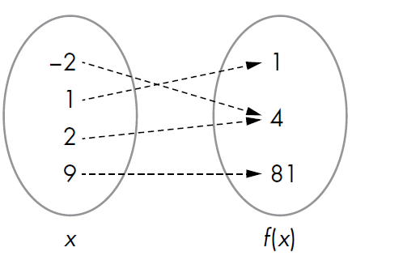

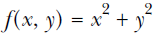

Domain and Range of a Function
--------------------------------

An Overview of Common Mathematical Functions
~~~~~~~~~~~~~~~~~~~~~~~~~~~~~~~~~~~~~~~~~~~~~~~~~~~

.. code-block:: python

    import math
    print(math.sin(math.pi/2))
    #1.0

    import sympy
    sympy.sin(math.pi/2)
    #1.00000000000000

    from sympy import Symbol
    theta = Symbol('theta')
    #print(math.sin(theta) + math.sin(theta))

    print(sympy.sin(theta) + sympy.sin(theta))
    #2*sin(theta)

    from sympy import sin, solve, Symbol
    u = Symbol('u')
    t = Symbol('t')
    g = Symbol('g')
    theta = Symbol('theta')
    print(solve(u*sin(theta)-g*t, t))
    #[u*sin(theta)/g]

Assumptions in SymPy
~~~~~~~~~~~~~~~~~~~~~~~~~

.. code-block:: python

    from sympy import Symbol
    x = Symbol('x')
    if (x+5) > 0:
        print('Do Something')
    else:
        print('Do Something else')

    ##

    x = Symbol('x', positive=True)
    if (x+5) > 0:
        print('Do Something')
    else:
        print('Do Something else')

Finding the Limit of Functions
~~~~~~~~~~~~~~~~~~~~~~~~~~~~~~~~

.. image:: ./img/chapter7-3.png

.. code-block:: python

    from sympy import Limit, Symbol, S
    x = Symbol('x')
    print(Limit(1/x, x, S.Infinity))
    #Limit(1/x, x, oo, dir='-')
    print(l.doit())
    print(Limit(1/x, x, 0, dir='-').doit())
    print(Limit(1/x, x, 0, dir='+').doit())

Continuous Compound Interest
~~~~~~~~~~~~~~~~~~~~~~~~~~~~~~~

.. image:: ./img/chapter7-4.png

.. code-block:: python

    from sympy import Limit, Symbol, S
    n = Symbol('n')
    print(Limit((1+1/n)**n, n, S.Infinity).doit())

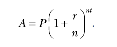

.. code-block:: python

    from sympy import Symbol, Limit, S
    p = Symbol('p', positive=True)
    r = Symbol('r', positive=True)
    t = Symbol('t', positive=True)
    print(Limit(p*(1+r/n)**(n*t), n, S.Infinity).doit())
    #p*exp(r*t)

Instantaneous Rate of Change
~~~~~~~~~~~~~~~~~~~~~~~~~~~~~~~

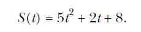

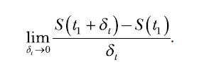

.. code-block:: python

    from sympy import Symbol, Limit
    t = Symbol('t')
    St = 5*t**2 + 2*t + 8
    t1 = Symbol('t1')
    delta_t = Symbol('delta_t')
    St1 = St.subs({t: t1})
    St1_delta = St.subs({t: t1 + delta_t})

    print(Limit((St1_delta-St1)/delta_t, delta_t, 0).doit())
    #10*t1 + 2

Finding the Derivative of Functions
--------------------------------------

.. code-block:: python

    from sympy import Derivative, Symbol
    x = Symbol('x')
    f = (x**3 + x**2 + x)*(x**2+x)
    print(Derivative(f, x).doit())
    #(2*x + 1)*(x**3 + x**2 + x) + (x**2 + x)*(3*x**2 + 2*x + 1)

A Derivative Calculator
~~~~~~~~~~~~~~~~~~~~~~~~~~~

.. code-block:: python

    '''
    Derivative calculator
    '''
    from sympy import Symbol, Derivative, sympify, pprint
    from sympy.core.sympify import SympifyError
    def derivative(f, var):
        var = Symbol(var)
        d = Derivative(f, var).doit()
        pprint(d)
    if __name__=='__main__':
        f = input('Enter a function: ')
        var = input('Enter the variable to differentiate with respect to: ')
        try:
            f = sympify(f)
        except SympifyError:
            print('Invalid input')
        else:
            derivative(f, var)

    #2*x**2 + 3*x + 1
    #x

Calculating Partial Derivatives
~~~~~~~~~~~~~~~~~~~~~~~~~~~~~~~~~~

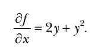

.. code-block:: python

    '''
    Derivative calculator
    '''
    from sympy import Symbol, Derivative, sympify, pprint
    from sympy.core.sympify import SympifyError
    def derivative(f, var):
        var = Symbol(var)
        d = Derivative(f, var).doit()
        pprint(d)
    if __name__=='__main__':
        f = input('Enter a function: ')
        var = input('Enter the variable to differentiate with respect to: ')
        try:
            f = sympify(f)
        except SympifyError:
            print('Invalid input')
        else:
            derivative(f, var)

    #2*x**2 + 3*x + 1
    #x

    #2*x*y + x*y**2
    #x

Higher-Order Derivatives and Finding the Maxima and Minima
-------------------------------------------------------------

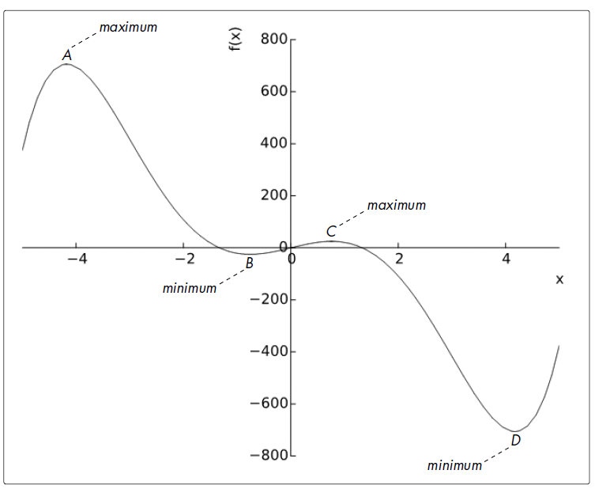

.. code-block:: python

    from sympy import Symbol, solve, Derivative
    x = Symbol('x')
    f = x**5 - 30*x**3 + 50*x
    d1 = Derivative(f, x).doit()
    critical_points = solve(d1)
    print(critical_points)
    #[-sqrt(-sqrt(71) + 9), sqrt(-sqrt(71) + 9), -sqrt(sqrt(71) + 9),
    #sqrt(sqrt(71) + 9)]

    A = critical_points[2]
    B = critical_points[0]
    C = critical_points[1]
    D = critical_points[3]

    d2 = Derivative(f, x, 2).doit()

    print(d2.subs({x:B}).evalf())
    #127.661060789073
    print(d2.subs({x:C}).evalf())
    #-127.661060789073
    print(d2.subs({x:A}).evalf())
    #-703.493179468151
    print(d2.subs({x:D}).evalf())
    #703.493179468151

    x_min = -5
    x_max = 5
    print(f.subs({x:A}).evalf())
    #705.959460380365
    print(f.subs({x:C}).evalf())
    #25.0846626340294
    print(f.subs({x:x_min}).evalf())
    #375.000000000000
    print(f.subs({x:x_max}).evalf())
    #-375.000000000000

    print(f.subs({x:B}).evalf())
    #-25.0846626340294
    print(f.subs({x:D}).evalf())
    #-705.959460380365
    print(f.subs({x:x_min}).evalf())
    #375.000000000000
    print(f.subs({x:x_max}).evalf())
    #-375.000000000000

Finding the Global Maximum Using Gradient Ascent
-----------------------------------------------------

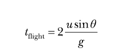

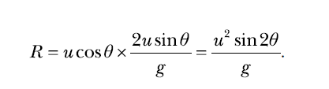

.. code-block:: python

    '''
    Use gradient ascent to find the angle at which the projectile
    has maximum range for a fixed velocity, 25 m/s
    '''
    import math
    from sympy import Derivative, Symbol, sin
    def grad_ascent(x0, f1x, x):
        epsilon = 1e-6
        step_size = 1e-4
        x_old = x0
        x_new = x_old + step_size*f1x.subs({x:x_old}).evalf()
        while abs(x_old - x_new) > epsilon:
            x_old = x_new
            x_new = x_old + step_size*f1x.subs({x:x_old}).evalf()
        return x_new

    def find_max_theta(R, theta):
        # Calculate the first derivative
        R1theta = Derivative(R, theta).doit()
        theta0 = 1e-3
        theta_max = grad_ascent(theta0, R1theta, theta)
        return theta_max
    if __name__ == '__main__':
        g = 9.8
        # Assume initial velocity
        u = 25
        # Expression for range
        theta = Symbol('theta')
        R = u**2*sin(2*theta)/g

        theta_max = find_max_theta(R, theta)
        print('Theta: {0}'.format(math.degrees(theta_max)))
        print('Maximum Range: {0}'.format(R.subs({theta:theta_max})))

    #Theta: 44.99999978475661
    #Maximum Range: 63.7755102040816

A Generic Program for Gradient Ascent
~~~~~~~~~~~~~~~~~~~~~~~~~~~~~~~~~~~~~~~

.. code-block:: python

    '''
    Use gradient ascent to find the maximum value of a
    single-variable function
    '''
    from sympy import Derivative, Symbol, sympify
    def grad_ascent(x0, f1x, x):
        epsilon = 1e-6
        step_size = 1e-4
        x_old = x0
        x_new = x_old + step_size*f1x.subs({x:x_old}).evalf()
    while abs(x_old - x_new) > epsilon:
        x_old = x_new
        x_new = x_old + step_size*f1x.subs({x:x_old}).evalf()
        return x_new
    if __name__ == '__main__':
        f = input('Enter a function in one variable: ')
        var = input('Enter the variable to differentiate with respect to: ')
        var0 = float(input('Enter the initial value of the variable: '))
    try:
        f = sympify(f)
    except SympifyError:
        print('Invalid function entered')
    else:
        var = Symbol(var)
        d = Derivative(f, var).doit()
        var_max = grad_ascent(var0, d, var)
        print('{0}: {1}'.format(var.name, var_max))
        print('Maximum value: {0}'.format(f.subs({var:var_max})))

    #===============================================================================
    # Enter a function in one variable: 25*25*sin(2*theta)/9.8
    # Enter the variable to differentiate with respect to: theta
    # Enter the initial value of the variable: 0.001
    # theta: 0.785360029379083
    # Maximum value: 63.7755100185965
    #===============================================================================

    #===============================================================================
    # Enter a function in one variable: cos(y)
    # Enter the variable to differentiate with respect to: y
    # Enter the initial value of the variable: 0.01
    # y: 0.00999900001666658
    # Maximum value: 0.999950010415832
    #===============================================================================

    #===============================================================================
    # Enter a function in one variable: cos(y) + k
    # Enter the variable to differentiate with respect to: y
    # Enter the initial value of the variable: 0.01
    # y: 0.00999900001666658
    # Maximum value: k + 0.999950010415832
    #===============================================================================

    #===============================================================================
    # Enter a function in one variable: x**5 - 30*x**3 + 50*x
    # Enter the variable to differentiate with respect to: x
    # Enter the initial value of the variable: -2
    # x: -4.17445116397103
    # Maximum value: 705.959460322318
    #===============================================================================

    #===============================================================================
    # Enter a function in one variable: x**5 - 30*x**3 + 50*x
    # Enter the variable to differentiate with respect to: x
    # Enter the initial value of the variable: 0.5
    # x: 0.757452532565767
    # Maximum value: 25.0846622605419
    #===============================================================================

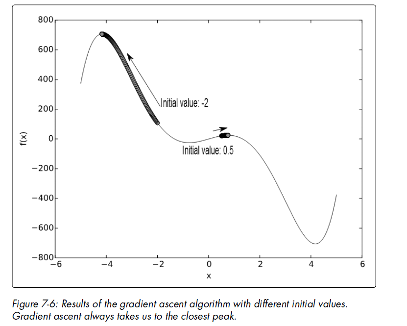

The Role of the Step Size and Epsilon
~~~~~~~~~~~~~~~~~~~~~~~~~~~~~~~~~~~~~~

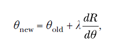

.. code-block:: python

    '''
    Use gradient ascent to find the maximum value of a
    single-variable function. This also checks for the existence
    of a solution for the equation f'(x)=0.
    '''
    from sympy import Derivative, Symbol, sympify, solve
    def grad_ascent(x0, f1x, x):
        # Check if f1x=0 has a solution
        if not solve(f1x):
            print('Cannot continue, solution for {0}=0 does not exist'.format(f1x))
            return
        epsilon = 1e-6
        step_size = 1e-4
        x_old = x0
        x_new = x_old + step_size*f1x.subs({x:x_old}).evalf()
    while abs(x_old - x_new) > epsilon:
        x_old = x_new
        x_new = x_old + step_size*f1x.subs({x:x_old}).evalf()
        return x_new

    if __name__ == '__main__':
        f = input('Enter a function in one variable: ')
        var = input('Enter the variable to differentiate with respect to: ')
        var0 = float(input('Enter the initial value of the variable: '))
        try:
            f = sympify(f)
        except SympifyError:
            print('Invalid function entered')
        else:
            var = Symbol(var)
            d = Derivative(f, var).doit()
            var_max = grad_ascent(var0, d, var)
        if var_max:
            print('{0}: {1}'.format(var.name, var_max))
            print('Maximum value: {0}'.format(f.subs({var:var_max})))

    #===============================================================================
    # Enter a function in one variable: log(x)
    # Enter the variable to differentiate with respect to: x
    # Enter the initial value of the variable: 0.1
    # Cannot continue, solution for 1/x=0 does not exist
    #===============================================================================

Finding the Integrals of Functions
-------------------------------------

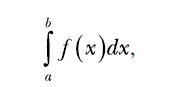

.. code-block:: python

    from sympy import Integral, Symbol

    if __name__=="__main__":
        x = Symbol('x')
        k = Symbol('k')
        print(Integral(k*x, x))
        #Integral(k*x, x)

        print(Integral(k*x, x).doit())
        #k*x**2/2
        print(Integral(k*x, (x, 0, 2)).doit())
        #2*k

    from sympy import Integral, Symbol
    x = Symbol('x')
    print(Integral(x, (x, 2, 4)).doit())

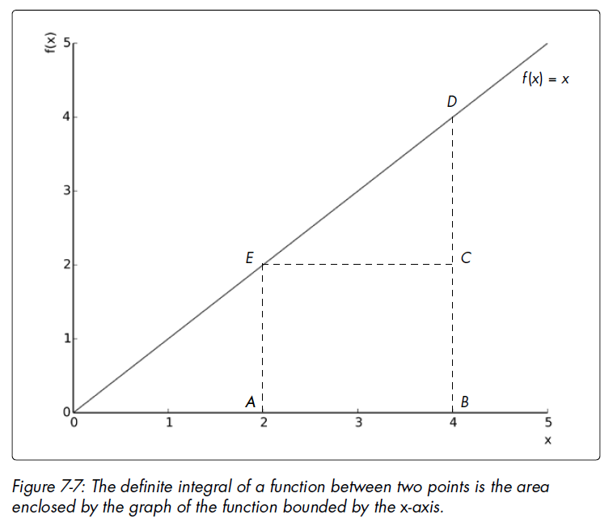

Probability Density Functions
--------------------------------

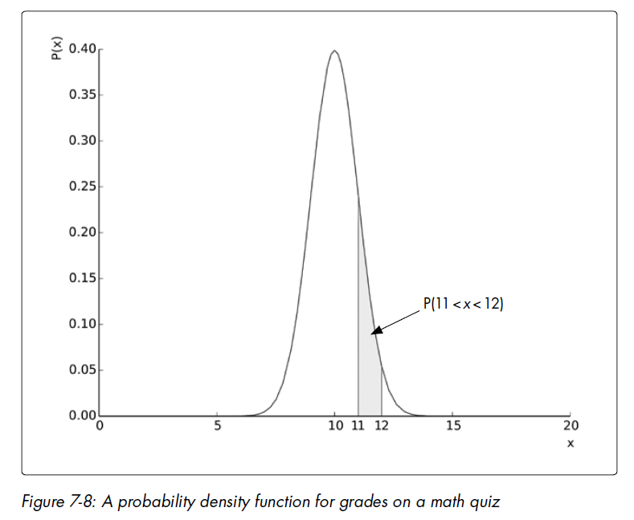

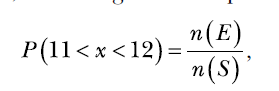

.. code-block:: python

    from sympy import Symbol, exp, sqrt, pi, Integral
    x = Symbol('x')
    p = exp(-(x - 10)**2/2)/sqrt(2*pi)
    print(Integral(p, (x, 11, 12)).doit().evalf())
    #0.135905121983278

    from sympy import Symbol, exp, sqrt, pi, Integral, S
    x = Symbol('x')
    p = exp(-(x – 10)**2/2)/sqrt(2*pi)
    print(Integral(p, (x, S.NegativeInfinity, S.Infinity)).doit().evalf())
    #1.00000000000000

