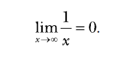
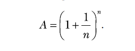

chapter 7: Sovling Calculs problems
==========================================
이 장에서는 Python standard library 와 SymPy를 이용한 코딩을 해보자.

.. image:: ./img/chapter7-2.png

Domain and Range of a Function
--------------------------------

An Overview of Common Mathematical Functions
~~~~~~~~~~~~~~~~~~~~~~~~~~~~~~~~~~~~~~~~~~~~~~~~~~~

.. code-block:: python

    import math
    print(math.sin(math.pi/2))
    #1.0

    import sympy
    sympy.sin(math.pi/2)
    #1.00000000000000

    from sympy import Symbol
    theta = Symbol('theta')
    #print(math.sin(theta) + math.sin(theta))

    print(sympy.sin(theta) + sympy.sin(theta))
    #2*sin(theta)

    from sympy import sin, solve, Symbol
    u = Symbol('u')
    t = Symbol('t')
    g = Symbol('g')
    theta = Symbol('theta')
    print(solve(u*sin(theta)-g*t, t))
    #[u*sin(theta)/g]

Assumptions in SymPy
~~~~~~~~~~~~~~~~~~~~~~~~~

.. code-block:: python

    from sympy import Symbol
    x = Symbol('x')
    if (x+5) > 0:
        print('Do Something')
    else:
        print('Do Something else')

    ##

    x = Symbol('x', positive=True)
    if (x+5) > 0:
        print('Do Something')
    else:
        print('Do Something else')

Finding the Limit of Functions
~~~~~~~~~~~~~~~~~~~~~~~~~~~~~~~~

.. code-block:: python

    from sympy import Limit, Symbol, S
    x = Symbol('x')
    print(Limit(1/x, x, S.Infinity))
    #Limit(1/x, x, oo, dir='-')
    print(l.doit())
    print(Limit(1/x, x, 0, dir='-').doit())
    print(Limit(1/x, x, 0, dir='+').doit())

Continuous Compound Interest
~~~~~~~~~~~~~~~~~~~~~~~~~~~~~~~

.. code-block:: python

    from sympy import Limit, Symbol, S
    n = Symbol('n')
    print(Limit((1+1/n)**n, n, S.Infinity).doit())

.. image:: ./img/chapter7-5.png

.. code-block:: python

    from sympy import Symbol, Limit, S
    p = Symbol('p', positive=True)
    r = Symbol('r', positive=True)
    t = Symbol('t', positive=True)
    print(Limit(p*(1+r/n)**(n*t), n, S.Infinity).doit())
    #p*exp(r*t)